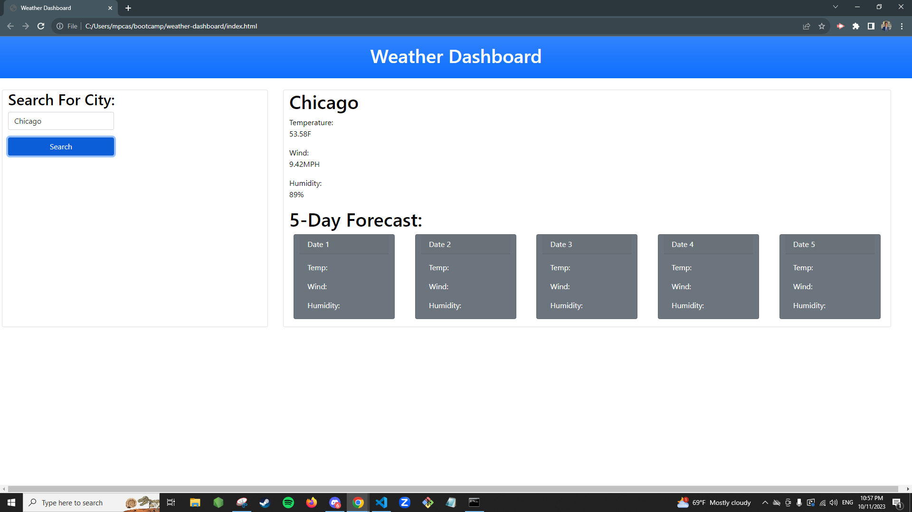

# Description

Creating a web application that takes multiple cities and displays their weather, along with forecast. It was fun challenging myself working with different APIs in order to produce results on a web page, especially when the forecast helps predict the weather based on existing weather patterns. I had difficulty retrieving the latitude and longitude needed to be used for retrieving data for the forecast per city inputted. If things worked out, I would have been able to populate the 5 next days' weather based on the city the user inputted.

## License

Refer to LICENSE

## Installation

- BootStrap

## References

- https://getbootstrap.com/docs/5.1/getting-started/introduction/
- https://getbootstrap.com/docs/5.1/components/card/
- https://openweathermap.org/forecast5
- https://openweathermap.org/current#name
- https://coding-boot-camp.github.io/full-stack/apis/how-to-use-api-keys
- https://openweathermap.org/forecast5
- https://openweathermap.org/api/geocoding-api#direct

## Screenshots

